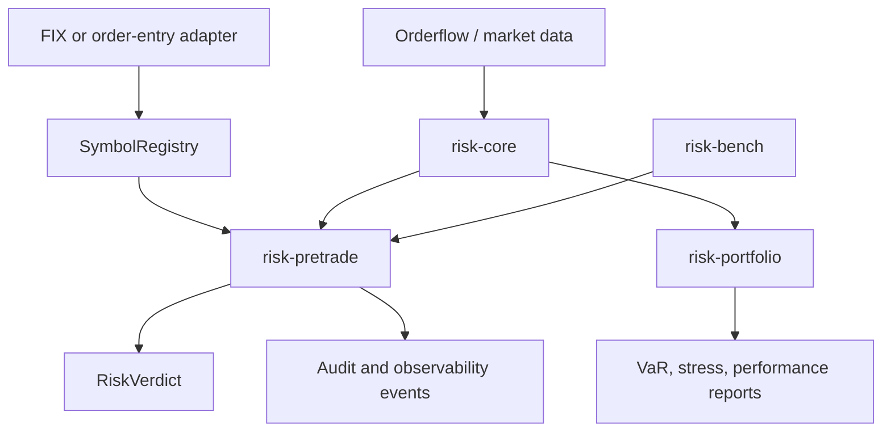
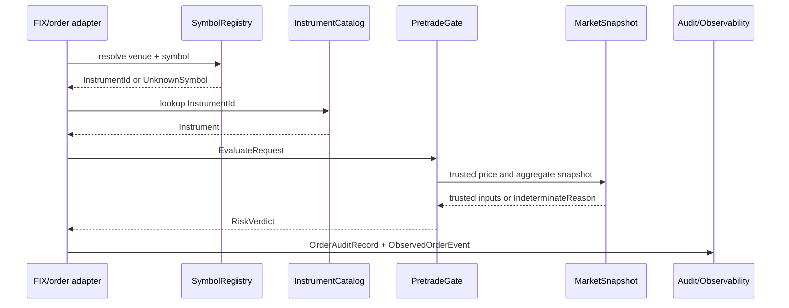
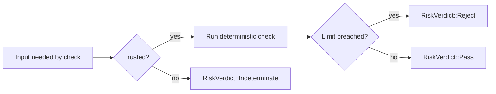

# Riskflow

Riskflow is a Rust risk-management workspace for multi-asset pretrade controls,
trusted market-data handling, audit evidence, and offline portfolio analytics.
It is built for developers who need deterministic risk decisions in order-entry
systems and reproducible analytics in validation or reporting workflows.

The workspace is split by runtime constraint. The pretrade path is synchronous,
fixed-point, and fail-closed. The portfolio path is batch-oriented,
allocation-friendly, and explicit about floating-point model assumptions. Shared
domain contracts live in `risk-core` so adapters, checks, analytics, tests, and
schemas agree on the same identifiers and verdict semantics.

## Who Should Start Where

| Reader | Start Here | Then Read |
|---|---|---|
| New user | [Getting Started](docs/getting_started.md) | [End-To-End Code Flow](docs/end_to_end_code_flow.md), [Architecture](docs/architecture.md) |
| Integrating order entry | [risk-pretrade README](risk-pretrade/README.md) | [risk-pretrade guide](docs/crates/risk-pretrade.md), [adapter example](risk-pretrade/examples/end_to_end_adapter.rs), [Observability](docs/observability.md) |
| Building analytics | [risk-portfolio README](risk-portfolio/README.md) | [risk-portfolio guide](docs/crates/risk-portfolio.md), [Model Validation](docs/model_validation.md), [Constants](docs/constants.md) |
| Reviewing safety | [Architecture](docs/architecture.md) | [Hardening](docs/hardening.md), [Security Review](docs/security_review.md) |
| Contributing | [Contributing](CONTRIBUTING.md) | [Release Governance](docs/release_governance.md), [Changelog](CHANGELOG.md) |
| Operating in production | [Operations](docs/operations.md) | [Benchmark Matrix](docs/benchmark_matrix.md), [Schemas](docs/schemas.md) |

## Workspace Map

```text
riskflow/
  risk-core/       shared fixed-point types, instruments, market snapshots, schemas
  risk-pretrade/   synchronous pretrade gate, limits, audit, observability
  risk-portfolio/  offline analytics: performance, VaR, stress scenarios, netting
  risk-bench/      benchmark harnesses and latency smoke reports
  docs/            architecture, validation, operations, governance, security
  scripts/         release evidence and governance automation
```

## Architecture At A Glance



Core dependency rule:

- `risk-core` defines shared types and never depends on higher-level crates.
- `risk-pretrade` and `risk-portfolio` depend on `risk-core`.
- Optional integrations belong at crate boundaries. The v1 public API is the
  active workspace shown above.

## Crates

### `risk-core`

Shared types and contracts:

- fixed-point `Price`, `Qty`, `Notional`, `Timestamp`,
- copyable `InstrumentId`,
- `Instrument` and `Position` enums,
- `MarketSnapshot` trust checks,
- upstream and risk-local data-quality flags,
- `RiskVerdict`, `RiskWeight`, reject and indeterminate reasons,
- startup-only `SymbolRegistry`,
- versioned external schema descriptors.

Read more:

- [risk-core README](risk-core/README.md)
- [risk-core guide](docs/crates/risk-core.md)
- [Reference-data example](risk-core/examples/reference_data_flow.rs)
- [End-to-end code flow](docs/end_to_end_code_flow.md)

### `risk-pretrade`

Synchronous pretrade gate:

- `ArcSwap` backed immutable limit snapshots,
- per-order notional checks,
- aggregate exposure checks,
- position-limit checks,
- margin checks for futures and perps,
- fat-finger price-band checks,
- audit records for order decisions and operational changes,
- metrics snapshots and structured observability events,
- file-backed and static v1 limit sources.

Read more:

- [risk-pretrade README](risk-pretrade/README.md)
- [risk-pretrade guide](docs/crates/risk-pretrade.md)
- [End-to-end adapter example](risk-pretrade/examples/end_to_end_adapter.rs)
- [End-to-end code flow](docs/end_to_end_code_flow.md)
- [Observability guide](docs/observability.md)

### `risk-portfolio`

Offline analytics:

- historical `VaR`,
- parametric normal `VaR`,
- seeded Monte Carlo `VaR`,
- marginal and component `VaR`,
- deterministic stress scenarios,
- performance summaries and drawdowns,
- cross-currency netting helpers,
- optional Python binding feature.

Read more:

- [risk-portfolio README](risk-portfolio/README.md)
- [risk-portfolio guide](docs/crates/risk-portfolio.md)
- [Portfolio report example](risk-portfolio/examples/portfolio_report.rs)
- [Portfolio analytics flow](docs/end_to_end_code_flow.md#portfolio-analytics-flow)
- [Model validation pack](docs/model_validation.md)

### `risk-bench`

Benchmark crate:

- steady-read pretrade evaluation benchmark,
- contended limit-update benchmark,
- release benchmark smoke command.

Read more:

- [risk-bench README](risk-bench/README.md)
- [risk-bench guide](docs/crates/risk-bench.md)
- [Benchmark fixture example](risk-bench/examples/benchmark_fixture.rs)
- [Benchmark methodology](docs/benchmarks.md)
- [Benchmark matrix](docs/benchmark_matrix.md)

## End-To-End Pretrade Flow



Minimal Rust example:

```rust
use risk_core::{
    CurrencyId, DataQuality, EquitySpec, Instrument, InstrumentId, MarketPrice,
    MarketSnapshot, Notional, Price, Qty, Timestamp,
};
use risk_pretrade::{EvaluateRequest, LimitTable, PretradeGate};

let instrument = Instrument::Equity(EquitySpec {
    instrument_id: InstrumentId(1),
    settlement_currency: CurrencyId(840),
});

let mut limits = LimitTable::new();
limits.set_per_order_notional(InstrumentId(1), Notional::new(1_000));
limits.set_aggregate_notional(Notional::new(10_000));
limits.set_max_abs_position(InstrumentId(1), Qty::new(100));
limits.set_fat_finger_band_bps(InstrumentId(1), 500);
limits.set_initial_margin_per_unit(InstrumentId(1), Notional::new(10));

let gate = PretradeGate::new(limits);

let mut market = MarketSnapshot::new(10, 10, 10);
market.insert_price(
    InstrumentId(1),
    MarketPrice::clean(Price::new(100), Timestamp(5)),
);
market.set_aggregate_notional(Notional::new(0), Timestamp(5), DataQuality::clean());

let verdict = gate.evaluate(EvaluateRequest {
    instrument,
    qty: Qty::new(5),
    current_position: Qty::new(0),
    available_margin: Notional::new(1_000),
    order_price: Price::new(100),
    market: &market,
    now: Timestamp(10),
});

assert!(verdict.is_pass());
```

Run the compiled adapter example:

```bash
cargo run -p risk-pretrade --example end_to_end_adapter
```

## Failure Model

Riskflow fails closed. Missing prices, stale snapshots, low-quality market
data, unknown symbols, unsupported options, stale aggregate exposure snapshots,
and arithmetic overflow do not produce a pass.



## Scope

The v1 critical path covers:

- equities,
- spot FX,
- spot crypto,
- futures,
- perpetual swaps.

Explicit non-goals:

- options pricing and Greeks in v1,
- regulatory capital,
- credit risk,
- liquidity risk,
- live exchange margin schedule ingestion,
- AI/ML risk-determining models.

Options are represented only as an unsupported v1 instrument taxonomy. They
return indeterminate risk and must not be treated as approved pretrade coverage.

## Documentation Index

Project fundamentals:

- [Getting Started](docs/getting_started.md)
- [End-To-End Code Flow](docs/end_to_end_code_flow.md)
- [Architecture](docs/architecture.md)
- [Contributing](CONTRIBUTING.md)
- [Changelog](CHANGELOG.md)

Crate guides:

- [risk-core](docs/crates/risk-core.md)
- [risk-pretrade](docs/crates/risk-pretrade.md)
- [risk-portfolio](docs/crates/risk-portfolio.md)
- [risk-bench](docs/crates/risk-bench.md)

Validation and operations:

- [Validation Pack](docs/validation.md)
- [Model Validation](docs/model_validation.md)
- [Operations Runbooks](docs/operations.md)
- [Observability](docs/observability.md)
- [Schema and Migration Policy](docs/schemas.md)
- [Benchmark Methodology](docs/benchmarks.md)
- [Benchmark Matrix](docs/benchmark_matrix.md)
- [Hardening Checks](docs/hardening.md)
- [Security Review Packet](docs/security_review.md)
- [Release Governance](docs/release_governance.md)
- [Constants and Fixture Values](docs/constants.md)

## Quality Gates

Run these before opening a PR:

```bash
cargo fmt --all --check
cargo clippy --workspace --all-targets --all-features -- -D warnings
cargo test --workspace --all-features
cargo test --workspace --examples --all-features
RUSTDOCFLAGS="-D warnings" cargo doc --workspace --all-features --no-deps
cargo run -p risk-core --example reference_data_flow
cargo run -p risk-pretrade --example end_to_end_adapter
cargo run -p risk-portfolio --example portfolio_report
cargo run -p risk-bench --example benchmark_fixture
cargo audit --db target/advisory-db
cargo deny check
cargo package -p risk-core --allow-dirty
cargo run -p risk-bench --release -- --iterations 5000
scripts/check_governance.sh
```

Generate a release evidence bundle:

```bash
scripts/release_evidence.sh target/release-evidence
```

## Repository Governance

The repository includes:

- `CODEOWNERS` for required review,
- a pull request template with risk review checklist,
- governance CI checks,
- release evidence workflow,
- protected environment approval workflow,
- self-hosted benchmark workflow for target hardware.

See [Release Governance](docs/release_governance.md) for the GitHub settings
required to make those controls enforceable.
