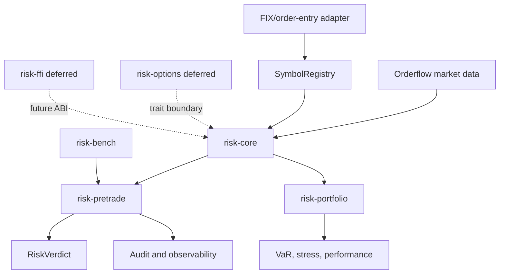
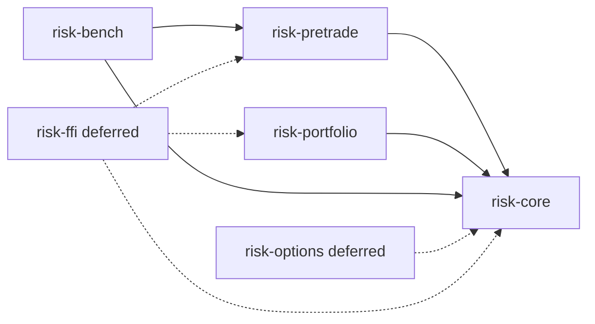
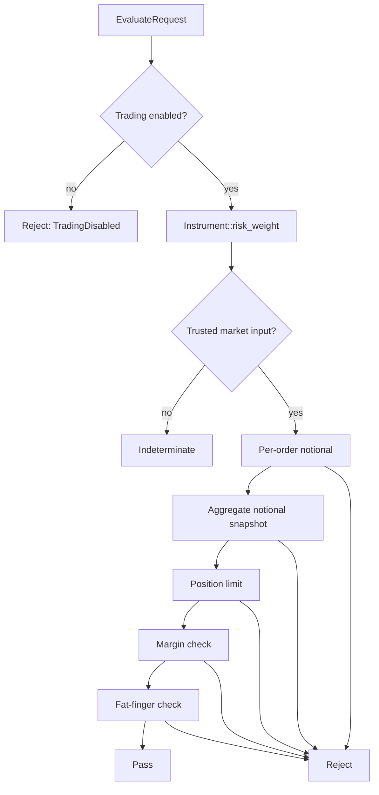
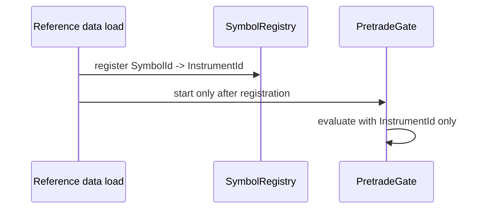

# Architecture

Riskflow separates latency-sensitive pretrade checks from offline analytics.
The split keeps the hot path small and deterministic while allowing portfolio
analytics to use allocation and matrix libraries.

## System Context



## Crate Dependency Contract



Rules:

- `risk-core` does not depend on workspace risk crates.
- `risk-pretrade` does not depend on `risk-portfolio` or `risk-options`.
- `risk-portfolio` does not depend on `risk-pretrade` or `risk-options`.
- `risk-bench` may depend on crates it benchmarks.
- `risk-options` and `risk-ffi` are deferred.

CI checks that `risk-pretrade` and `risk-portfolio` do not depend on
`risk-options`.

## Pretrade Evaluation Flow



The check order is intentional. Operational disablement is first. Then the gate
requires a trusted risk weight before evaluating deterministic limits.

## Market Trust Model

`MarketSnapshot` owns trust checks:

- missing instrument price,
- stale instrument price,
- upstream data-quality flags,
- missing FX rate,
- stale FX rate,
- source disagreement,
- stale or missing aggregate exposure snapshot.

Untrusted data returns an `IndeterminateReason`.

## Symbol Resolution

`of_core::SymbolId` contains strings and is not used in the hot path.
Riskflow maps it once during startup:



Unknown symbols fail closed before order evaluation.

## Numeric Model

Pretrade:

- fixed-point `i64` wrappers,
- checked arithmetic,
- no `f64` in limit comparisons,
- overflow becomes indeterminate.

Portfolio:

- `f64` analytics,
- deterministic seeded simulations,
- typed errors for diagnostic APIs.

## Schema Model

External records use versioned schema descriptors in `risk-core::schema`.
Limit files may include:

```text
schema_version,1,0,0
```

See [Schemas](schemas.md) for compatibility and migration rules.

## Observability Model

Pretrade exposes:

- `OrderAuditRecord`,
- `LimitChangeAuditRecord`,
- `TradingStateAuditRecord`,
- `GateMetricsSnapshot`,
- `ObservedOrderEvent`,
- `PretradeAlert`.

The library does not force a logging or tracing runtime. Adapters decide how to
export these records.
