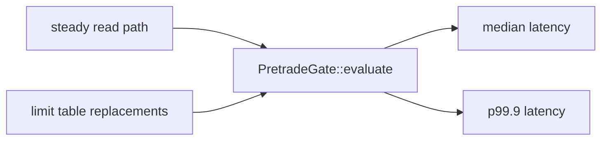

# `risk-bench`

`risk-bench` contains benchmark harnesses and release smoke commands for the
pretrade gate. It is separated from production crates so benchmark-only
dependencies do not leak into normal builds.

## What It Measures



Benchmarks cover:

- steady-read pretrade evaluation,
- evaluation while limit snapshots are repeatedly replaced,
- command-line smoke reporting for release evidence.

## Command-Line Smoke

Short local smoke:

```bash
cargo run -p risk-bench --release -- --iterations 5000
```

Release evidence smoke:

```bash
cargo run -p risk-bench --release -- --iterations 50000
```

Expected output shape:

```text
pretrade evaluate latency report
iterations: 50000
steady_read.median_ns: ...
steady_read.p99_9_ns: ...
contended_updates.median_ns: ...
contended_updates.p99_9_ns: ...
```

## Criterion Bench

```bash
cargo bench -p risk-bench --bench evaluate -- --test
```

The Criterion harness is useful during development. The command-line smoke is
more useful for release evidence because it emits a compact text report that CI
can archive.

## Benchmark Construction

The harness builds:

- one equity instrument,
- one limit table,
- one trusted market snapshot,
- one valid order request.

The contended-update path alternates limit-table versions while evaluating.
This is not a full exchange simulation; it isolates the overhead of the gate
and the chosen limit snapshot strategy.

## Reporting Rules

Record production-like results in [Benchmark Matrix](../benchmark_matrix.md).
Rows must include:

- hardware,
- operating system and kernel,
- Rust version,
- iteration count,
- median latency,
- p99.9 latency,
- whether the runner was a development, CI, or production-like host.

Laptop and WSL results are development baselines only.

## Extension Points

Add a new benchmark when:

- a new pretrade check enters the hot path,
- limit storage changes,
- market snapshot lookup behavior changes,
- observability changes add measurable overhead.

Keep benchmark fixtures deterministic and documented.
