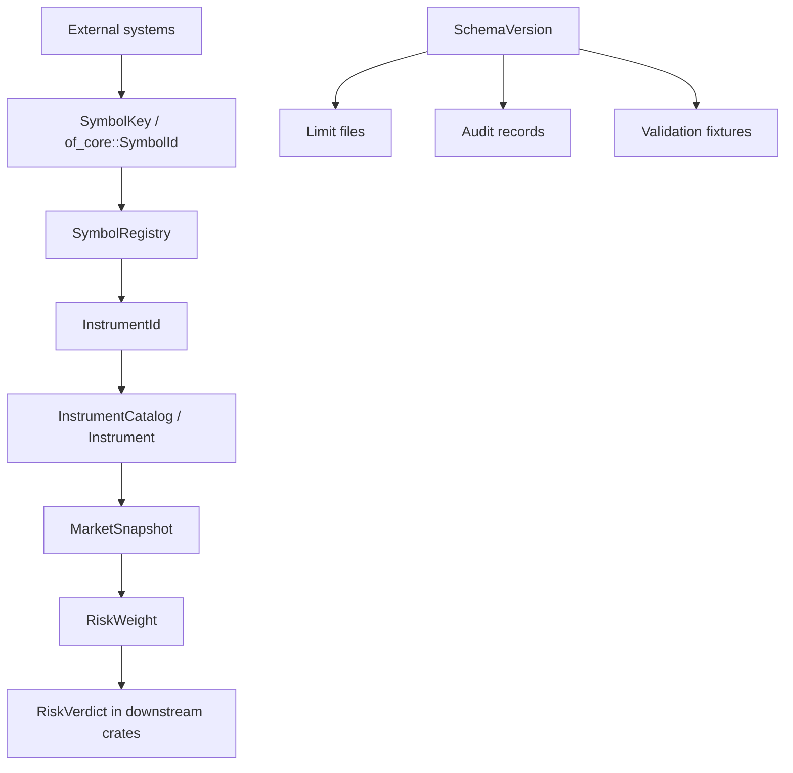
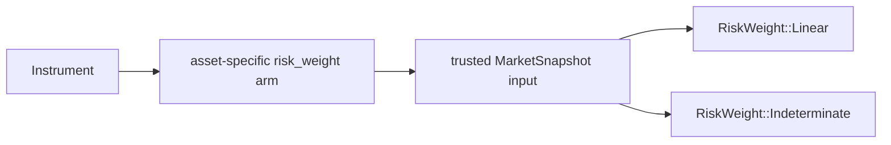

# `risk-core`

`risk-core` is the shared contract crate for Riskflow. It owns the types that
must mean the same thing in the pretrade gate, portfolio analytics, benchmark
harnesses, adapters, validation fixtures, and external integrations.

The crate is intentionally small in behavior and strict in semantics. It does
not know how to run a pretrade policy, it does not compute portfolio reports,
and it does not own I/O. It defines the vocabulary and trust rules that the
other crates build on.

## Mental Model



The most important idea is that external, allocating, or text-heavy identifiers
are resolved before the hot path. The gate receives cheap `Copy` values and
pre-built reference data.

## Module Map

| Module | Owns | Used By |
|---|---|---|
| `types` | `InstrumentId`, `Price`, `Qty`, `Notional`, `Timestamp` | every crate |
| `currency` | `CurrencyId`, `CurrencyPair` | market snapshots, netting |
| `instrument` | `Instrument`, specs, `RiskExposure`, `InstrumentCatalog` | pretrade, portfolio |
| `position` | dynamic `Position`, `MarginState`, `Funding` | adapters and analytics |
| `market` | `MarketSnapshot`, `MarketPrice`, data-quality flags | pretrade, netting |
| `symbol` | `SymbolRegistry`, `SymbolKey` | adapters, validation |
| `schema` | schema version constants and descriptors | parsers, docs, release governance |
| `verdict` | `RiskWeight`, `RiskVerdict`, reasons | all risk decisions |

## Fixed-Point Types

The pretrade path uses fixed-point wrappers around integer primitives. The
wrappers do not hide scale policy: adapters and instrument reference data own
the scale convention. The wrappers enforce checked arithmetic and prevent
accidental use of `f64` in limit comparisons.

```rust
use risk_core::{Notional, Price, Qty};

let price = Price::new(50_000);
let qty = Qty::new(-2);
let multiplier = 10;

let exposure = Notional::checked_linear(price, qty, multiplier)
    .expect("small fixture values do not overflow");

assert_eq!(exposure.raw(), 1_000_000);
```

Overflow returns `None`. Downstream risk checks convert that into
`IndeterminateReason::ArithmeticOverflow`, not a pass.

## Symbol Resolution Flow

`of_core::SymbolId` is re-exported as `SymbolKey`. It contains string data, so
it is a boundary type, not a hot-path type.

```rust
use risk_core::{InstrumentId, SymbolKey, SymbolRegistry};

let mut registry = SymbolRegistry::new();
let symbol = SymbolKey {
    venue: "XNYS".to_owned(),
    symbol: "IBM".to_owned(),
};

registry.register(symbol.clone(), InstrumentId(1)).unwrap();
let id = registry.resolve(&symbol).unwrap();

assert_eq!(id, InstrumentId(1));
```

Expected lifecycle:

1. Load reference data.
2. Assign stable `InstrumentId`s.
3. Register all symbols.
4. Build the `InstrumentCatalog`.
5. Start order evaluation.

Unknown symbols produce `IndeterminateReason::UnknownSymbol` before the gate is
called.

## Instrument Catalog Flow

`InstrumentCatalog` is startup-loaded static reference data. It maps
`InstrumentId` to an `Instrument` enum.

```rust
use risk_core::{
    CurrencyId, EquitySpec, Instrument, InstrumentCatalog, InstrumentId,
};

let instrument = Instrument::Equity(EquitySpec {
    instrument_id: InstrumentId(1),
    settlement_currency: CurrencyId(840),
});

let mut catalog = InstrumentCatalog::new();
catalog.insert(instrument).unwrap();

assert_eq!(catalog.get(InstrumentId(1)), Some(instrument));
```

Duplicate ids are rejected. This matters because the pretrade gate assumes that
an `InstrumentId` resolves to one unambiguous static instrument definition.

## Market Snapshot Trust Flow

`MarketSnapshot` centralizes trust checks. Consumers should ask for trusted
prices or rates instead of reading raw maps.

```rust
use risk_core::{
    InstrumentId, MarketPrice, MarketSnapshot, Price, Timestamp,
};

let mut market = MarketSnapshot::new(10, 10, 10);
market.insert_price(
    InstrumentId(1),
    MarketPrice::clean(Price::new(100), Timestamp(5)),
);

let trusted = market.trusted_price(InstrumentId(1), Timestamp(10)).unwrap();
assert_eq!(trusted, Price::new(100));
```

Trust checks cover:

- missing instrument price,
- stale instrument price,
- bad upstream data-quality flags,
- bad risk-local data-quality flags,
- missing FX rate,
- stale FX rate,
- source disagreement,
- missing aggregate snapshot,
- stale aggregate snapshot.

## Risk Weight Flow

`Instrument::risk_weight` is the uniform exposure boundary. The pretrade gate
does not branch on asset class inside every check; it asks the instrument for a
risk weight.



Linear instruments use checked fixed-point notional. Options intentionally
return `UnsupportedOption` in v1.

## Verdict Types

`RiskVerdict` separates deterministic limit breaches from uncertainty:

- `Pass`: all evaluated checks passed.
- `Reject`: deterministic rule or operational state rejected the order.
- `Indeterminate`: the gate cannot compute a trustworthy answer.

This distinction is important for audit. A fat-finger reject and a stale market
price are not the same operational event.

## Schema Versions

`schema.rs` defines record families and current versions:

- instrument reference,
- limit table,
- audit record,
- market snapshot,
- portfolio validation.

Use `current_schema(SchemaRecordKind::LimitTable)` when a parser, exporter, or
adapter needs to declare which schema family it emits.

## Maintainer Guidance

Most users should not need to modify `risk-core`; it is the shared contract
crate. Changes here affect semver, schemas, validation fixtures, and downstream
adapters. Treat additions as public API work and update the linked documentation
in the same pull request.

### Adding A Linear Asset Class

1. Add an `AssetClass` variant.
2. Add a spec struct.
3. Add an `Instrument` variant.
4. Add a `Position` variant if dynamic state differs.
5. Implement `Instrument::id`, `asset_class`, `risk_weight`, `currencies`, and
   `settlement_currency` arms.
6. Add unit tests and adapter fixtures.
7. Update this crate guide and the root README scope.

### Adding An External Record Schema

1. Add a `SchemaRecordKind` variant.
2. Add a current schema constant.
3. Update `current_schema`.
4. Document compatibility in `docs/schemas.md`.
5. Add parser or fixture tests.

## Source Map

- `risk-core/src/types.rs`: checked arithmetic.
- `risk-core/src/market.rs`: trusted market-data behavior.
- `risk-core/src/instrument.rs`: option indeterminate behavior and catalog
  behavior.
- `risk-core/src/symbol.rs`: symbol resolution.
- `risk-core/tests/numeric_properties.rs`: property checks against wider
  integer reference arithmetic.

## Verification

```bash
cargo test -p risk-core --all-features
cargo test -p risk-core --test numeric_properties
cargo run -p risk-core --example reference_data_flow
RUSTDOCFLAGS="-D warnings" cargo doc -p risk-core --all-features --no-deps
```
