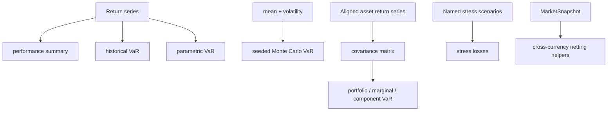

# `risk-portfolio`

`risk-portfolio` is the offline analytics crate. It is allowed to allocate,
use matrix libraries, and operate on `f64` because it is not part of the
pretrade settlement or limit-comparison path.

The crate is still deterministic where randomness is involved. Monte Carlo
analytics require an explicit seed.

## Module Map

| Module | Owns |
|---|---|
| `performance` | mean, volatility, Sharpe, Sortino, Calmar, drawdown |
| `var` | historical, parametric, Monte Carlo, component and marginal `VaR` |
| `covariance` | sample covariance matrix construction |
| `scenario` | deterministic return shocks and named stress scenarios |
| `netting` | cross-currency helper wrappers around trusted market snapshots |
| `python` | optional PyO3 wrappers |
| `greeks` | reserved empty boundary for future options work |

## Analytics Flow



## Error Model

Most analytics have two API shapes:

- compact `Option` wrappers for simple use,
- typed `try_*` functions for diagnostics.

Example:

```rust
use risk_portfolio::var::{VarError, try_historical_var};

let returns = [0.02, -0.05, 0.01, -0.10, 0.03];
let var = try_historical_var(&returns, 0.95).unwrap();

assert!(var >= 0.0);
assert_eq!(try_historical_var(&[], 0.95), Err(VarError::EmptyInput));
```

## Performance Summary Example

```rust
use risk_portfolio::performance::summarize_returns;

let returns = [0.01, -0.02, 0.03, 0.01, -0.01];
let summary = summarize_returns(&returns, 0.0).unwrap();

assert!(summary.volatility >= 0.0);
assert!(summary.max_drawdown >= 0.0);
```

## Historical VaR Example

Historical `VaR` sorts returns and selects a deterministic tail loss.

```rust
use risk_portfolio::var::historical_var;

let returns = [0.03, -0.02, -0.10, 0.01, -0.05];
let var = historical_var(&returns, 0.80).unwrap();

assert_eq!(var, 0.10);
```

## Parametric VaR And Attribution

Parametric attribution uses weights and a covariance matrix. The component
contributions sum to portfolio `VaR` within floating-point tolerance.

```rust
use nalgebra::dmatrix;
use risk_portfolio::var::try_parametric_var_attribution;

let weights = [0.6, 0.4];
let covariance = dmatrix![0.04, 0.01; 0.01, 0.09];

let report = try_parametric_var_attribution(&weights, &covariance, 0.95).unwrap();
let component_sum = report.component_var.iter().sum::<f64>();

assert!((report.portfolio_var - component_sum).abs() < 1e-12);
```

## Seeded Monte Carlo VaR

The deterministic seed is part of the input contract.

```rust
use risk_portfolio::var::{SimulationSeed, monte_carlo_var};

let first = monte_carlo_var(0.0, 0.02, 0.95, 1_000, SimulationSeed(42));
let second = monte_carlo_var(0.0, 0.02, 0.95, 1_000, SimulationSeed(42));

assert_eq!(first, second);
```

## Stress Scenario Example

```rust
use risk_portfolio::scenario::{
    ScenarioShock, StressScenario, try_run_stress_scenarios,
};

let base_returns = [0.01, 0.0];
let weights = [0.6, 0.4];
let scenarios = [
    StressScenario::new("equity_down", vec![ScenarioShock::new(0, -0.10)]),
    StressScenario::new(
        "broad_riskoff",
        vec![ScenarioShock::new(0, -0.08), ScenarioShock::new(1, -0.04)],
    ),
];

let results = try_run_stress_scenarios(&base_returns, &weights, &scenarios).unwrap();

assert_eq!(results.len(), 2);
assert!(results[0].result.portfolio_loss >= 0.0);
```

## Covariance Flow

```rust
use risk_portfolio::covariance::sample_covariance_matrix;

let first = [0.01, 0.02, -0.01, 0.03];
let second = [0.00, 0.01, -0.02, 0.04];

let matrix = sample_covariance_matrix(&[&first, &second]).unwrap();

assert_eq!(matrix.nrows(), 2);
assert_eq!(matrix.ncols(), 2);
```

## Netting Helpers

`netting` does not bypass trust checks. It delegates to `MarketSnapshot`.

```rust
use risk_core::{
    CurrencyId, CurrencyPair, MarketPrice, MarketSnapshot, Notional, Price, Timestamp,
};
use risk_portfolio::netting::convert_notional_to_currency;

let mut market = MarketSnapshot::new(10, 10, 10);
let pair = CurrencyPair::new(CurrencyId(840), CurrencyId(978));
market.insert_fx_rate(pair, MarketPrice::clean(Price::new(2), Timestamp(5)));

let converted = convert_notional_to_currency(
    &market,
    Notional::new(100),
    pair,
    Timestamp(10),
).unwrap();

assert_eq!(converted, Notional::new(200));
```

## Validation Fixtures

- `risk-portfolio/tests/golden_var.rs`: longer historical `VaR` fixtures.
- `risk-portfolio/tests/golden_stress.rs`: deterministic stress fixtures.
- `risk-portfolio/tests/fixtures/historical_var.csv`: calm, crisis, and
  positive-return return series.
- `risk-portfolio/tests/fixtures/stress_scenarios.csv`: single and multi-asset
  stress shocks.

## Extension Points

### Add A New Analytics Function

1. Decide whether the compact API should return `Option` or a typed `Result`.
2. Validate empty, shape-mismatched, and non-finite inputs.
3. Add unit tests for normal and invalid inputs.
4. Add a golden fixture if the output is externally meaningful.
5. Document assumptions in `docs/model_validation.md`.

### Add A New Python Binding

1. Gate it behind the existing `python` feature.
2. Keep the Rust API primary.
3. Validate Python-facing shape errors explicitly.
4. Add Rust tests that compile under `--all-features`.

## Verification

```bash
cargo test -p risk-portfolio --all-features
cargo test -p risk-portfolio --test golden_stress
cargo test -p risk-portfolio --test golden_var
```
