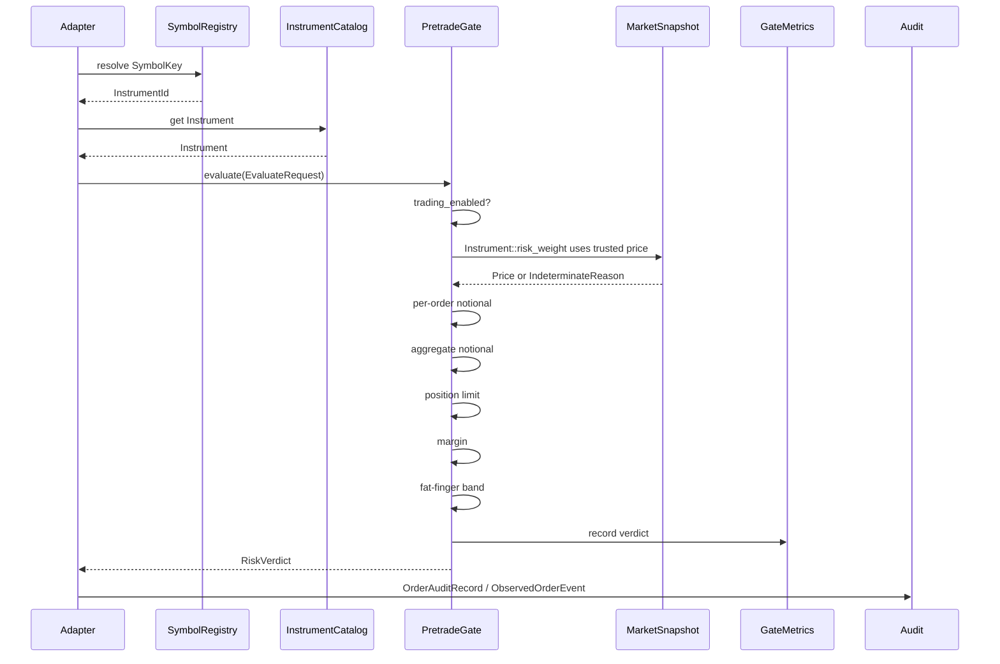

# `risk-pretrade`

`risk-pretrade` is the synchronous gate used by order-entry adapters before an
order leaves the system. It evaluates a fixed sequence of deterministic checks
against immutable limit snapshots and trusted market data.

The design goal is boring predictability: no user-selected concurrency model,
no trait-object check pipeline, no hidden default pass on missing data, and no
floating-point arithmetic in limit comparisons.

## End-To-End Code Flow



## Module Map

| Module | Owns |
|---|---|
| `gate` | `LimitTable`, `EvaluateRequest`, `PretradeGate` |
| `checks/notional` | per-order notional limit check |
| `checks/aggregate_notional` | aggregate exposure snapshot check |
| `checks/position_limit` | max absolute post-order position check |
| `checks/margin` | futures and perpetual initial margin check |
| `checks/fat_finger` | submitted price versus trusted market price |
| `limit_source` | static and file-backed v1 limit sources |
| `audit` | auditable records for order, limit, and trading-state events |
| `observability` | metrics snapshots, trace context, structured events, alerts |

## Limit Table Lifecycle

`LimitTable` is mutable during construction and immutable once installed in the
gate.

```rust
use risk_core::{InstrumentId, Notional, Qty};
use risk_pretrade::{LimitTable, PretradeGate};

let mut limits = LimitTable::new();
limits.set_per_order_notional(InstrumentId(1), Notional::new(1_000));
limits.set_aggregate_notional(Notional::new(10_000));
limits.set_max_abs_position(InstrumentId(1), Qty::new(100));
limits.set_fat_finger_band_bps(InstrumentId(1), 500);
limits.set_initial_margin_per_unit(InstrumentId(1), Notional::new(10));

let gate = PretradeGate::new(limits);
assert!(gate.trading_enabled());
```

Limit updates replace the entire snapshot:

```rust
use risk_core::Timestamp;
use risk_pretrade::{LimitTable, PretradeGate};

let gate = PretradeGate::new(LimitTable::new());
let record = gate.update_limits_with_audit(
    LimitTable::new(),
    "file-limit-source",
    Timestamp(1),
);

assert_eq!(record.actor, "file-limit-source");
assert_eq!(gate.metrics_snapshot().limit_updates, 1);
```

## File-Backed Limits

Supported records:

```text
schema_version,1,0,0
aggregate_notional,10000
per_order_notional,1,1000
max_abs_position,1,50
fat_finger_band_bps,1,250
initial_margin_per_unit,1,10
```

Parsing example:

```rust
use risk_core::{InstrumentId, Notional};
use risk_pretrade::parse_limit_table;

let limits = parse_limit_table(
    "schema_version,1,0,0\n\
     aggregate_notional,10000\n\
     per_order_notional,1,1000\n",
).unwrap();

assert_eq!(limits.aggregate_notional_limit(), Some(Notional::new(10_000)));
assert_eq!(limits.per_order_notional(InstrumentId(1)), Some(Notional::new(1_000)));
```

## Evaluation Request Example

```rust
use risk_core::{
    CurrencyId, DataQuality, EquitySpec, Instrument, InstrumentId, MarketPrice,
    MarketSnapshot, Notional, Price, Qty, Timestamp,
};
use risk_pretrade::{EvaluateRequest, LimitTable, PretradeGate};

let instrument = Instrument::Equity(EquitySpec {
    instrument_id: InstrumentId(1),
    settlement_currency: CurrencyId(840),
});

let mut limits = LimitTable::new();
limits.set_per_order_notional(InstrumentId(1), Notional::new(1_000));
limits.set_aggregate_notional(Notional::new(10_000));
limits.set_max_abs_position(InstrumentId(1), Qty::new(100));
limits.set_fat_finger_band_bps(InstrumentId(1), 500);
limits.set_initial_margin_per_unit(InstrumentId(1), Notional::new(10));

let gate = PretradeGate::new(limits);

let mut market = MarketSnapshot::new(10, 10, 10);
market.insert_price(
    InstrumentId(1),
    MarketPrice::clean(Price::new(100), Timestamp(5)),
);
market.set_aggregate_notional(Notional::new(0), Timestamp(5), DataQuality::clean());

let verdict = gate.evaluate(EvaluateRequest {
    instrument,
    qty: Qty::new(5),
    current_position: Qty::new(0),
    available_margin: Notional::new(1_000),
    order_price: Price::new(100),
    market: &market,
    now: Timestamp(10),
});

assert!(verdict.is_pass());
```

## Check Pipeline Details

### 1. Trading State

Trading can be disabled operationally. Disabled trading returns
`RejectReason::TradingDisabled` before market data or limits are consulted.

### 2. Risk Weight

The gate calls `request.instrument.risk_weight`. Missing price, stale price,
bad data quality, unsupported options, and arithmetic overflow become
`RiskVerdict::Indeterminate`.

### 3. Per-Order Notional

Compares current order exposure against the instrument-specific configured
limit.

### 4. Aggregate Notional

Reads the aggregate base-currency notional snapshot from `MarketSnapshot`. If
the snapshot is missing, stale, or low quality, the result is indeterminate.

### 5. Position Limit

Computes post-order position with checked addition and compares absolute
quantity against the configured max position.

### 6. Margin

Futures and perpetual swaps check initial margin per unit against available
margin. Missing margin config fails closed.

### 7. Fat-Finger

Compares submitted order price to trusted market price within the configured
basis-point band.

## Observability Example

```rust
use risk_core::{RiskVerdict, Timestamp};
use risk_pretrade::{
    GateMetrics, ObservedOrderEvent, OrderAuditRecord, PretradeAlert, TraceContext,
};

let metrics = GateMetrics::default();
metrics.record_verdict(RiskVerdict::Pass);
let snapshot = metrics.snapshot();

assert_eq!(snapshot.evaluations, 1);
assert!(PretradeAlert::from_verdict(RiskVerdict::Pass).is_none());

# let audit: OrderAuditRecord = todo!("adapter builds this from evaluate_with_audit");
# let _event = ObservedOrderEvent::new(
#     TraceContext { correlation_id: 7, sequence: 1, observed_at: Timestamp(1) },
#     audit,
#     snapshot,
# );
```

Adapters are expected to export `ObservedOrderEvent` into whatever telemetry
system they use. The crate intentionally does not depend on a logging runtime.

## Adapter Tests To Read

- `risk-pretrade/examples/end_to_end_adapter.rs`: complete adapter shape.
- `risk-pretrade/tests/adapter_contracts.rs`: symbol mapping and market-data
  boundary behavior.
- `risk-pretrade/tests/adversarial_pretrade.rs`: fail-closed adversarial
  scenarios.
- `risk-pretrade/tests/golden_pretrade.rs`: CSV fixture decisions.

## Extension Points

### Add A New Check

1. Add a module under `checks/`.
2. Keep the function concrete and allocation-free.
3. Return `RiskVerdict`.
4. Insert it into `PretradeGate::evaluate_decision`.
5. Add unit tests and fixture coverage.
6. Update this guide and `docs/validation.md`.

### Add A New Limit Record

1. Add storage to `LimitTable`.
2. Add setter/getter methods.
3. Update `LimitTableSummary` if operationally relevant.
4. Update `parse_limit_table`.
5. Add parser tests for valid and malformed records.
6. Update `docs/schemas.md`.

## Verification

```bash
cargo test -p risk-pretrade --all-features
cargo test -p risk-pretrade --test golden_pretrade
cargo test -p risk-pretrade --test adapter_contracts
cargo test -p risk-pretrade --test adversarial_pretrade
cargo run -p risk-pretrade --example end_to_end_adapter
```
