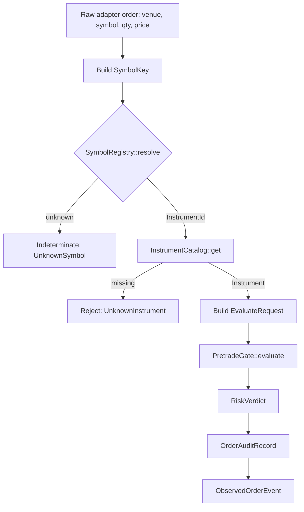
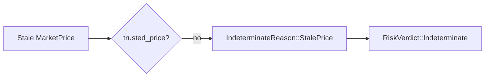
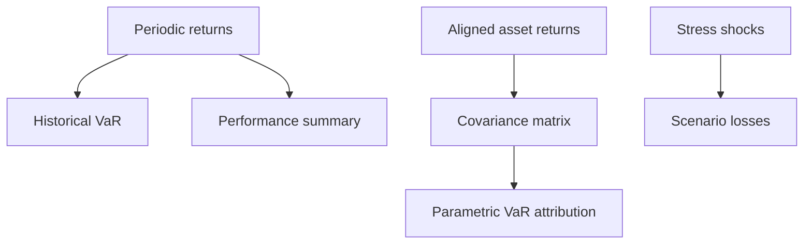

# End-To-End Code Flow

This document follows one order from adapter input through pretrade evaluation,
then shows how the same core data model supports offline portfolio analytics.

## Pretrade Order Flow



## Full Example

```rust
use risk_core::{
    CurrencyId, DataQuality, EquitySpec, Instrument, InstrumentCatalog,
    InstrumentId, MarketPrice, MarketSnapshot, Notional, Price, Qty, SymbolKey,
    SymbolRegistry, Timestamp,
};
use risk_pretrade::{
    EvaluateRequest, GateAuditRecord, InMemoryAuditLog, LimitTable,
    ObservedOrderEvent, PretradeGate, TraceContext,
};

let mut registry = SymbolRegistry::new();
let mut catalog = InstrumentCatalog::new();
let instrument = Instrument::Equity(EquitySpec {
    instrument_id: InstrumentId(1),
    settlement_currency: CurrencyId(840),
});

registry
    .register(
        SymbolKey {
            venue: "XNYS".to_owned(),
            symbol: "IBM".to_owned(),
        },
        InstrumentId(1),
    )
    .unwrap();
catalog.insert(instrument).unwrap();

let mut limits = LimitTable::new();
limits.set_per_order_notional(InstrumentId(1), Notional::new(1_000));
limits.set_aggregate_notional(Notional::new(10_000));
limits.set_max_abs_position(InstrumentId(1), Qty::new(100));
limits.set_fat_finger_band_bps(InstrumentId(1), 500);
limits.set_initial_margin_per_unit(InstrumentId(1), Notional::new(10));

let gate = PretradeGate::new(limits);

let mut market = MarketSnapshot::new(10, 10, 10);
market.insert_price(
    InstrumentId(1),
    MarketPrice::clean(Price::new(100), Timestamp(5)),
);
market.set_aggregate_notional(Notional::new(0), Timestamp(5), DataQuality::clean());

let symbol = SymbolKey {
    venue: "XNYS".to_owned(),
    symbol: "IBM".to_owned(),
};
let instrument_id = registry.resolve(&symbol).unwrap();
let instrument = catalog.get(instrument_id).unwrap();

let (verdict, audit) = gate.evaluate_with_audit(EvaluateRequest {
    instrument,
    qty: Qty::new(5),
    current_position: Qty::new(0),
    available_margin: Notional::new(1_000),
    order_price: Price::new(100),
    market: &market,
    now: Timestamp(10),
});

let observed = ObservedOrderEvent::new(
    TraceContext {
        correlation_id: 42,
        sequence: 1,
        observed_at: Timestamp(10),
    },
    audit.clone(),
    gate.metrics_snapshot(),
);

let mut audit_log = InMemoryAuditLog::new();
audit_log.push(GateAuditRecord::OrderEvaluation(audit));

assert!(verdict.is_pass());
assert_eq!(observed.metrics.evaluations, 1);
assert_eq!(audit_log.records().len(), 1);
```

The compiled version of this flow lives in
`risk-pretrade/examples/end_to_end_adapter.rs`.

## Fail-Closed Variant

Change the market timestamp from `Timestamp(5)` to `Timestamp(0)` while
evaluating at `Timestamp(20)` and the price becomes stale. The gate returns
`RiskVerdict::Indeterminate(IndeterminateReason::StalePrice)`.



This behavior is covered by `risk-pretrade/tests/adapter_contracts.rs`.

## Portfolio Analytics Flow



Example:

```rust
use nalgebra::dmatrix;
use risk_portfolio::{
    covariance::sample_covariance_matrix,
    performance::summarize_returns,
    scenario::{ScenarioShock, StressScenario, try_run_stress_scenarios},
    var::{SimulationSeed, monte_carlo_var, try_parametric_var_attribution},
};

let returns = [0.01, -0.02, 0.03, 0.01, -0.01];
let summary = summarize_returns(&returns, 0.0).unwrap();
assert!(summary.volatility >= 0.0);

let mc_var = monte_carlo_var(0.0, 0.02, 0.95, 1_000, SimulationSeed(42));
assert!(mc_var.is_some());

let first = [0.01, 0.02, -0.01, 0.03];
let second = [0.00, 0.01, -0.02, 0.04];
let covariance = sample_covariance_matrix(&[&first, &second]).unwrap();
let weights = [0.6, 0.4];
let attribution = try_parametric_var_attribution(&weights, &covariance, 0.95).unwrap();
assert_eq!(attribution.component_var.len(), 2);

let stress = [StressScenario::new(
    "broad_riskoff",
    vec![ScenarioShock::new(0, -0.08), ScenarioShock::new(1, -0.04)],
)];
let results = try_run_stress_scenarios(&[0.01, 0.0], &weights, &stress).unwrap();
assert_eq!(results[0].name, "broad_riskoff");
```

## Where To Look In Code

| Behavior | File |
|---|---|
| fixed-point arithmetic | `risk-core/src/types.rs` |
| symbol startup mapping | `risk-core/src/symbol.rs` |
| market trust checks | `risk-core/src/market.rs` |
| instrument risk weight | `risk-core/src/instrument.rs` |
| pretrade pipeline | `risk-pretrade/src/gate.rs` |
| limit parser | `risk-pretrade/src/limit_source.rs` |
| observability | `risk-pretrade/src/observability.rs` |
| historical and parametric `VaR` | `risk-portfolio/src/var.rs` |
| stress scenarios | `risk-portfolio/src/scenario.rs` |
| benchmark CLI | `risk-bench/src/main.rs` |

## Verification

```bash
cargo run -p risk-pretrade --example end_to_end_adapter
cargo test -p risk-pretrade --test adapter_contracts
cargo test -p risk-pretrade --test adversarial_pretrade
cargo test -p risk-portfolio --test golden_var
cargo test -p risk-portfolio --test golden_stress
```
