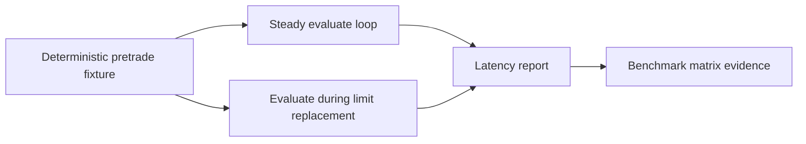

# risk-bench

Benchmark harnesses for Riskflow pretrade evaluation.

`risk-bench` is separate from production crates so benchmark dependencies stay
out of normal library builds.

Primary documentation:

- [risk-bench crate guide](https://github.com/gregorian-09/riskflow/blob/master/docs/crates/risk-bench.md)
- [Benchmark methodology](https://github.com/gregorian-09/riskflow/blob/master/docs/benchmarks.md)
- [Benchmark matrix](https://github.com/gregorian-09/riskflow/blob/master/docs/benchmark_matrix.md)
- [Release governance](https://github.com/gregorian-09/riskflow/blob/master/docs/release_governance.md)

## What It Measures

- steady-read `PretradeGate::evaluate`,
- evaluation while limit snapshots are replaced,
- median latency,
- p99.9 latency.



## Command-Line Smoke

```bash
cargo run -p risk-bench --release -- --iterations 5000
```

Expected output shape:

```text
pretrade evaluate latency report
iterations: 5000
steady_read.median_ns: ...
steady_read.p99_9_ns: ...
contended_updates.median_ns: ...
contended_updates.p99_9_ns: ...
```

## Criterion Bench

```bash
cargo bench -p risk-bench --bench evaluate -- --test
```

Use Criterion during development when comparing code changes locally. Use the
command-line smoke for release evidence because it emits compact text that CI
can archive.

## Production Benchmark Runner

The GitHub benchmark workflow expects a self-hosted runner labeled
`risk-prod-bench` when collecting production-like evidence. A development
machine or WSL host can validate the workflow wiring, but release claims should
come from the documented benchmark machine recorded in
[Benchmark Matrix](https://github.com/gregorian-09/riskflow/blob/master/docs/benchmark_matrix.md).

Each benchmark record should include:

- CPU model and core count,
- operating system and kernel,
- Rust version,
- iteration count,
- median and p99.9 latency for steady reads,
- median and p99.9 latency during contended limit updates,
- whether the host is development, CI, or production-like.

## Read Next

- [Full crate guide](https://github.com/gregorian-09/riskflow/blob/master/docs/crates/risk-bench.md) for fixture construction and reporting rules.
- [Benchmark methodology](https://github.com/gregorian-09/riskflow/blob/master/docs/benchmarks.md) for reproducible run conditions.
- [Release governance](https://github.com/gregorian-09/riskflow/blob/master/docs/release_governance.md) for required evidence workflows.

## Verify

```bash
cargo run -p risk-bench --release -- --iterations 5000
cargo bench -p risk-bench --bench evaluate -- --test
```
