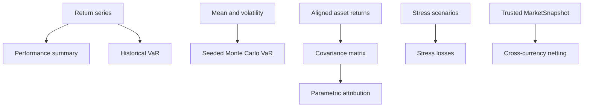

# risk-portfolio

Offline portfolio analytics for Riskflow.

`risk-portfolio` is the reporting and analytics crate. It uses `f64` and matrix
math because it is not part of the fixed-point pretrade hot path. Simulation
analytics are deterministic through explicit seeds.

Primary documentation:

- [risk-portfolio crate guide](https://github.com/gregorian-09/riskflow/blob/master/docs/crates/risk-portfolio.md)
- [Portfolio analytics flow](https://github.com/gregorian-09/riskflow/blob/master/docs/end_to_end_code_flow.md#portfolio-analytics-flow)
- [Model Validation](https://github.com/gregorian-09/riskflow/blob/master/docs/model_validation.md)
- [Validation](https://github.com/gregorian-09/riskflow/blob/master/docs/validation.md)

## Runtime Contract

`risk-portfolio` is for offline or asynchronous workflows: validation packs,
daily reports, notebooks, scenario analysis, and release evidence. It is not in
the pretrade hot path and does not make order-routing decisions.

The crate exposes compact APIs for common analytics and typed `try_*` APIs when
callers need diagnostics for empty data, invalid confidence levels,
non-finite inputs, or shape mismatches.

## Analytics Surface

- performance summaries,
- historical `VaR`,
- parametric `VaR`,
- seeded Monte Carlo `VaR`,
- component and marginal `VaR`,
- covariance matrices,
- deterministic stress scenarios,
- cross-currency netting helpers,
- optional Python binding feature.



## Historical And Monte Carlo VaR

```rust
use risk_portfolio::var::{SimulationSeed, historical_var, monte_carlo_var};

let returns = [0.03, -0.02, -0.10, 0.01, -0.05];
let historical = historical_var(&returns, 0.80).unwrap();
let simulated = monte_carlo_var(0.0, 0.02, 0.95, 1_000, SimulationSeed(42)).unwrap();

assert_eq!(historical, 0.10);
assert!(simulated >= 0.0);
```

## Performance Summary

```rust
use risk_portfolio::performance::summarize_returns;

let returns = [0.01, -0.02, 0.03, 0.01, -0.01];
let summary = summarize_returns(&returns, 0.0).unwrap();

assert!(summary.volatility >= 0.0);
assert!(summary.max_drawdown >= 0.0);
```

## Parametric Attribution

```rust
use nalgebra::dmatrix;
use risk_portfolio::var::try_parametric_var_attribution;

let weights = [0.6, 0.4];
let covariance = dmatrix![0.04, 0.01; 0.01, 0.09];

let report = try_parametric_var_attribution(&weights, &covariance, 0.95).unwrap();
let component_sum = report.component_var.iter().sum::<f64>();

assert!((report.portfolio_var - component_sum).abs() < 1e-12);
```

## Stress Scenarios

```rust
use risk_portfolio::scenario::{
    ScenarioShock, StressScenario, try_run_stress_scenarios,
};

let base_returns = [0.01, 0.0];
let weights = [0.6, 0.4];
let scenarios = [
    StressScenario::new(
        "broad_riskoff",
        vec![ScenarioShock::new(0, -0.08), ScenarioShock::new(1, -0.04)],
    ),
];

let results = try_run_stress_scenarios(&base_returns, &weights, &scenarios).unwrap();
assert_eq!(results[0].name, "broad_riskoff");
```

## Read Next

- [Full crate guide](https://github.com/gregorian-09/riskflow/blob/master/docs/crates/risk-portfolio.md) for covariance, netting, error models, and validation fixtures.
- [Model validation pack](https://github.com/gregorian-09/riskflow/blob/master/docs/model_validation.md) for assumptions and independent review sign-off.
- [Validation pack](https://github.com/gregorian-09/riskflow/blob/master/docs/validation.md) for golden scenario evidence.

## Verify

```bash
cargo test -p risk-portfolio --all-features
RUSTDOCFLAGS="-D warnings" cargo doc -p risk-portfolio --all-features --no-deps
```
