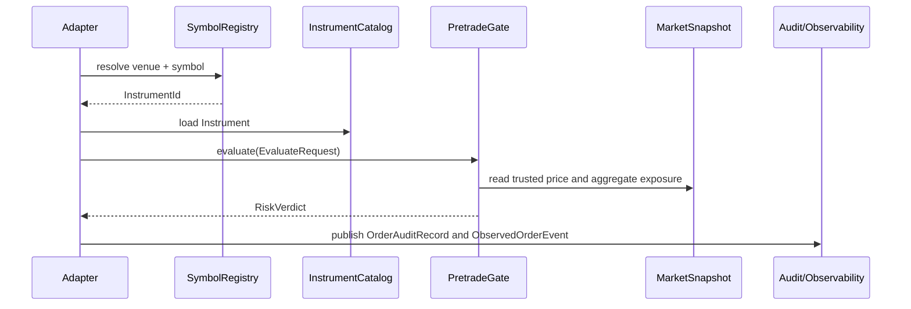

# risk-pretrade

Synchronous pretrade risk gate for Riskflow.

`risk-pretrade` is the order-entry crate. It evaluates a concrete sequence of
checks against trusted market data and immutable limit snapshots. It emits
audit records and observability payloads that adapters can export.

Primary documentation:

- [risk-pretrade crate guide](https://github.com/gregorian-09/riskflow/blob/master/docs/crates/risk-pretrade.md)
- [End-to-end adapter example](https://github.com/gregorian-09/riskflow/blob/master/risk-pretrade/examples/end_to_end_adapter.rs)
- [End-to-end code flow](https://github.com/gregorian-09/riskflow/blob/master/docs/end_to_end_code_flow.md)
- [Validation](https://github.com/gregorian-09/riskflow/blob/master/docs/validation.md)
- [Observability](https://github.com/gregorian-09/riskflow/blob/master/docs/observability.md)

## Public API Inventory

Primary public types:

- Gate and requests: `PretradeGate`, `EvaluateRequest`, `LimitTable`.
- Limit loading: `LimitSource`, `StaticLimitSource`, `FileLimitSource`,
  `parse_limit_table`, `ParseLimitTableError`, `ParseLimitTableErrorKind`.
- Audit records: `OrderAuditRecord`, `LimitChangeAuditRecord`,
  `TradingStateAuditRecord`, `GateAuditRecord`, `InMemoryAuditLog`.
- Observability: `GateMetrics`, `GateMetricsSnapshot`, `TraceContext`,
  `ObservedOrderEvent`, `ObservedLimitChangeEvent`,
  `ObservedTradingStateEvent`, `PretradeAlert`, `AlertSeverity`.

## Runtime Contract

`PretradeGate::evaluate` is synchronous and fail-closed. It accepts an
`EvaluateRequest` containing an already resolved `Instrument`, current order
quantity, current position, available margin, submitted price, trusted market
snapshot, and evaluation timestamp. It returns a `RiskVerdict`.

The gate has one mutable operational surface: replacing the active
`LimitTable`. Updates install a whole immutable snapshot, so readers do not
observe partially applied limit changes.

## Check Pipeline

1. Trading enabled.
2. Instrument risk weight.
3. Per-order notional.
4. Aggregate notional snapshot.
5. Position limit.
6. Margin.
7. Fat-finger price band.

Any missing, stale, low-quality, overflowing, or unsupported input fails
closed.

## Type Semantics Reference

- `EvaluateRequest` is the complete input for one order decision. It contains
  resolved static instrument data, current position, available margin, submitted
  price, trusted market snapshot, and evaluation timestamp.
- `LimitTable` is the active immutable policy snapshot once installed in
  `PretradeGate`.
- `PretradeGate` owns operational state: trading enabled/disabled, current
  limits, and metrics counters.
- `OrderAuditRecord` is the durable decision payload for one evaluated order.
- `ObservedOrderEvent` combines adapter trace context, audit payload, and a
  metrics snapshot for logs or telemetry.
- `PretradeAlert` maps verdict categories into operator-facing severity.

## Choosing The Right API

| Need | Use |
|---|---|
| Evaluate an order without audit payload | `PretradeGate::evaluate` |
| Evaluate and capture an order audit record | `PretradeGate::evaluate_with_audit` |
| Replace limits atomically | `PretradeGate::update_limits` |
| Replace limits with audit evidence | `PretradeGate::update_limits_with_audit` |
| Disable or enable trading operationally | `disable_trading_with_audit` / `enable_trading_with_audit` |
| Load a versioned limit file | `FileLimitSource` |
| Parse limit text already loaded by an adapter | `parse_limit_table` |
| Export counters | `PretradeGate::metrics_snapshot` |



## Minimal Evaluation

```rust
use risk_core::{
    CurrencyId, DataQuality, EquitySpec, Instrument, InstrumentId, MarketPrice,
    MarketSnapshot, Notional, Price, Qty, Timestamp,
};
use risk_pretrade::{EvaluateRequest, LimitTable, PretradeGate};

let instrument = Instrument::Equity(EquitySpec {
    instrument_id: InstrumentId(1),
    settlement_currency: CurrencyId(840),
});

let mut limits = LimitTable::new();
limits.set_per_order_notional(InstrumentId(1), Notional::new(1_000));
limits.set_aggregate_notional(Notional::new(10_000));
limits.set_max_abs_position(InstrumentId(1), Qty::new(100));
limits.set_fat_finger_band_bps(InstrumentId(1), 500);
limits.set_initial_margin_per_unit(InstrumentId(1), Notional::new(10));

let gate = PretradeGate::new(limits);

let mut market = MarketSnapshot::new(10, 10, 10);
market.insert_price(
    InstrumentId(1),
    MarketPrice::clean(Price::new(100), Timestamp(5)),
);
market.set_aggregate_notional(Notional::new(0), Timestamp(5), DataQuality::clean());

let verdict = gate.evaluate(EvaluateRequest {
    instrument,
    qty: Qty::new(5),
    current_position: Qty::new(0),
    available_margin: Notional::new(1_000),
    order_price: Price::new(100),
    market: &market,
    now: Timestamp(10),
});

assert!(verdict.is_pass());
```

## Limit Files

`parse_limit_table` accepts the v1 CSV-like limit format used by the file limit
source:

```text
schema_version,1,0,0
aggregate_notional,10000
per_order_notional,1,1000
max_abs_position,1,50
fat_finger_band_bps,1,250
initial_margin_per_unit,1,10
```

Limit changes that matter operationally can be installed with audit evidence:

```rust
use risk_core::Timestamp;
use risk_pretrade::{LimitTable, PretradeGate};

let gate = PretradeGate::new(LimitTable::new());
let audit = gate.update_limits_with_audit(
    LimitTable::new(),
    "limit-change-ticket-1234",
    Timestamp(100),
);

assert_eq!(audit.actor, "limit-change-ticket-1234");
```

## Adapter Example

Run the end-to-end adapter example:

```bash
cargo run -p risk-pretrade --example end_to_end_adapter
```

The example shows reference-data loading, symbol resolution, market snapshot
construction, gate evaluation, audit logging, and observed event construction
in one executable flow.

## Real-World Use Cases

### Synchronous order-entry control

Call `PretradeGate::evaluate` before an order leaves the adapter. Treat
`Reject` and `Indeterminate` as non-send outcomes and preserve the verdict for
operator review.

### Limit-change workflow

Load a versioned limit file, build a full `LimitTable`, replace the active
snapshot atomically, and store the returned `LimitChangeAuditRecord` alongside
the change ticket.

### Production telemetry bridge

Use `TraceContext`, `ObservedOrderEvent`, and `PretradeAlert` to export
decision telemetry without forcing the crate to depend on a specific logging or
metrics runtime.

## Read Next

- [Full crate guide](https://github.com/gregorian-09/riskflow/blob/master/docs/crates/risk-pretrade.md) for check-by-check behavior.
- [Observability guide](https://github.com/gregorian-09/riskflow/blob/master/docs/observability.md) for metrics, alerts, and event payloads.
- [Validation pack](https://github.com/gregorian-09/riskflow/blob/master/docs/validation.md) for golden and adversarial scenarios.

## Verify

```bash
cargo test -p risk-pretrade --all-features
cargo run -p risk-pretrade --example end_to_end_adapter
```
